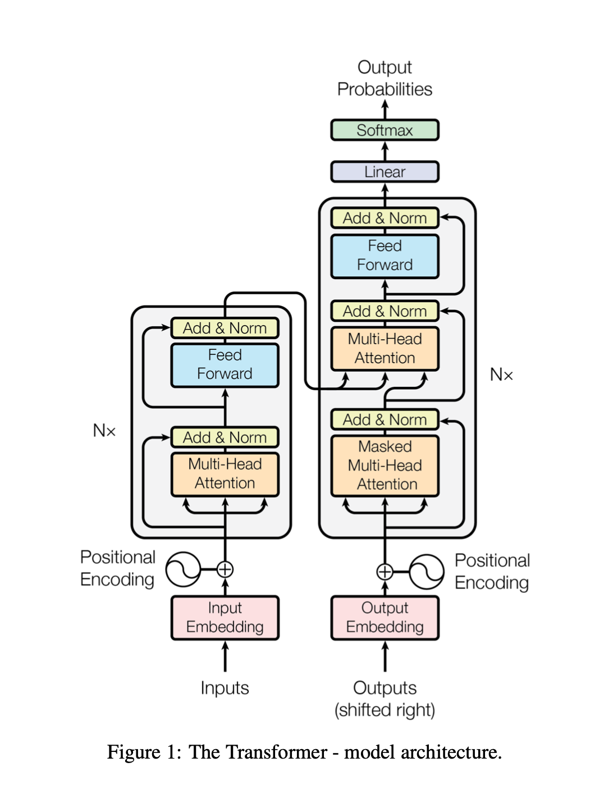

# Attention Is All You Need

### Notes by: Katie Haller

In the embedding, words are represented by vectors. The idea is to create a mapping of the words so that similar words are "close" to each other. For example, we don't want a model to predict "I fed my (car)". We want the model to predict "I fed my (cat)". This way, cats and dogs and say fish are grouped together. So if the model doesn't predict "cat", it will predict "dog". The concept makes sense, however, the details of how this happens are still fuzzy. It will make more sense when I look at the details in the code.

The positional encoders help with relation to other words in the sentence. The equations used are:

$$PE_{(pos,2i)}=sin(pos/10000^{2i/d_{model}})$$
$$PE_{(pos,2i+1)}=cos(pos/10000^{2i/d_{model}})$$

$pos$ is the position and $i$ is the dimension. So what does this actually mean? We know both $sin$ and $cos$ oscillate between -1 and 1.