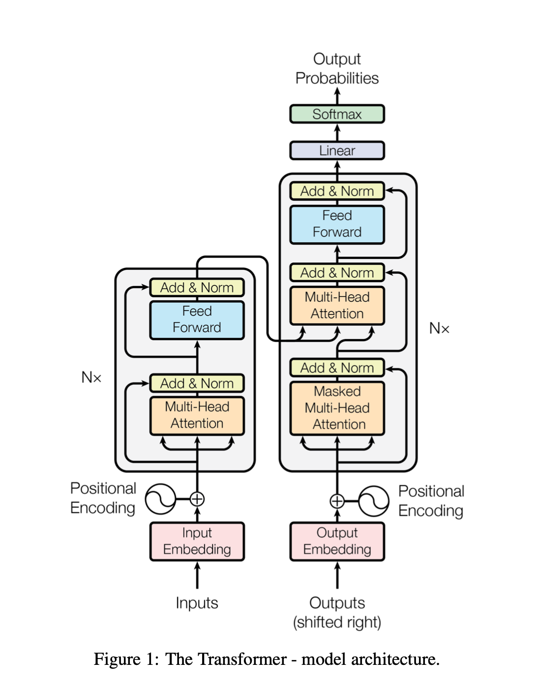
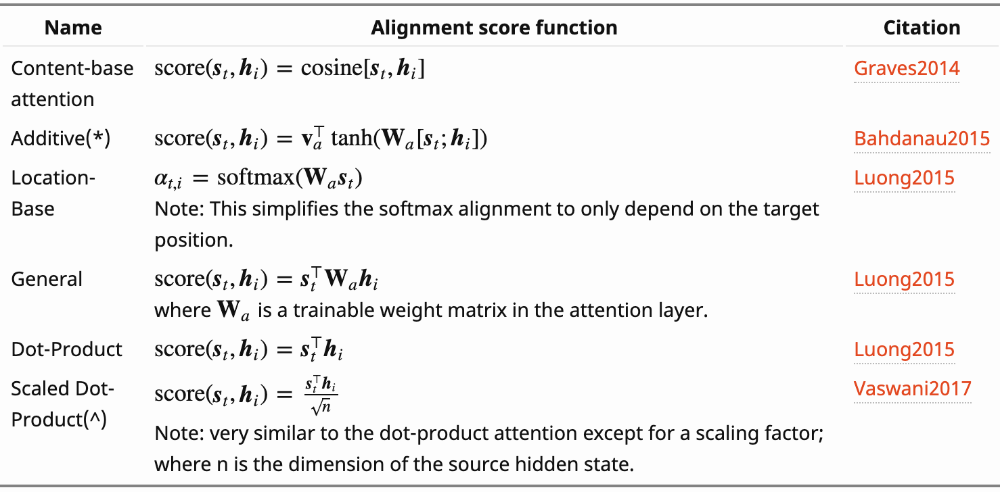
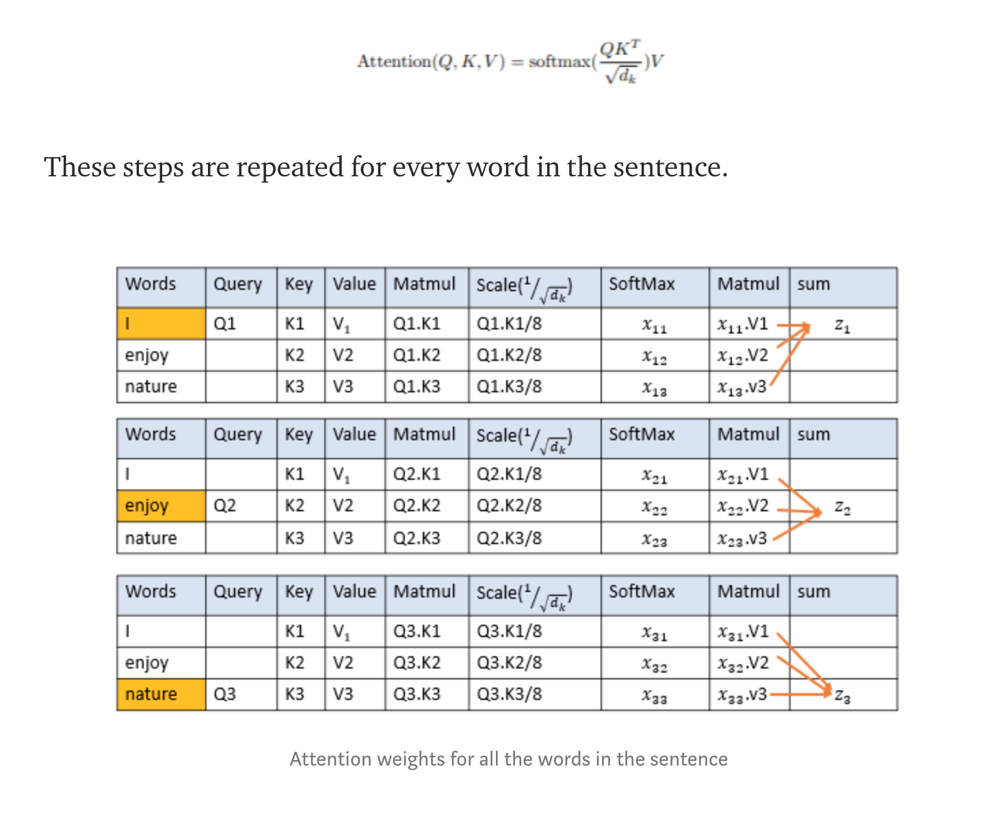
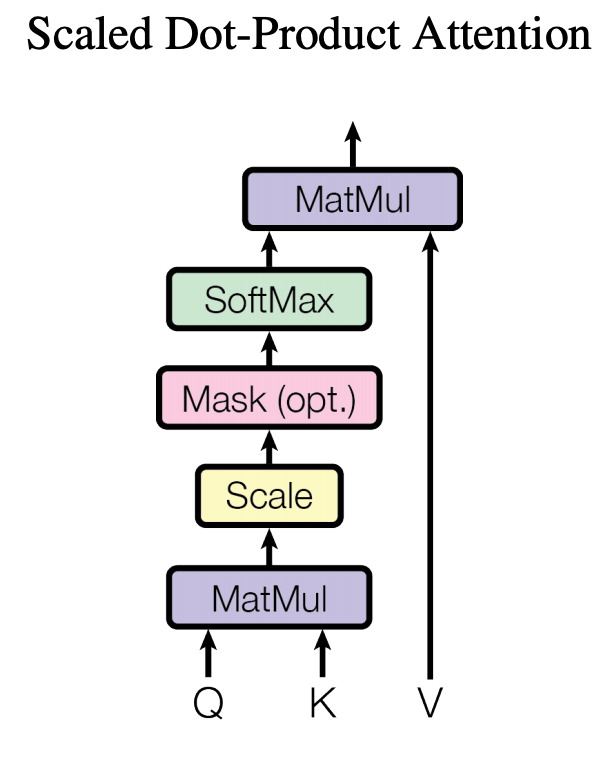
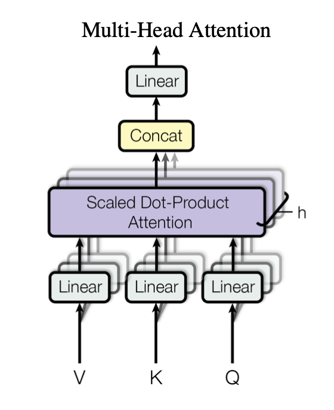
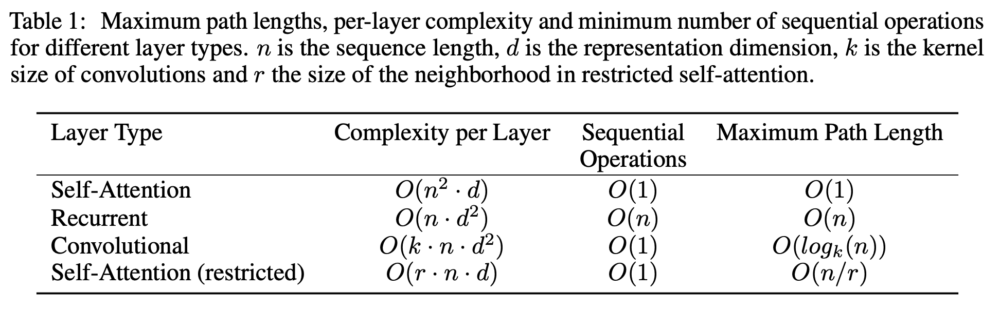
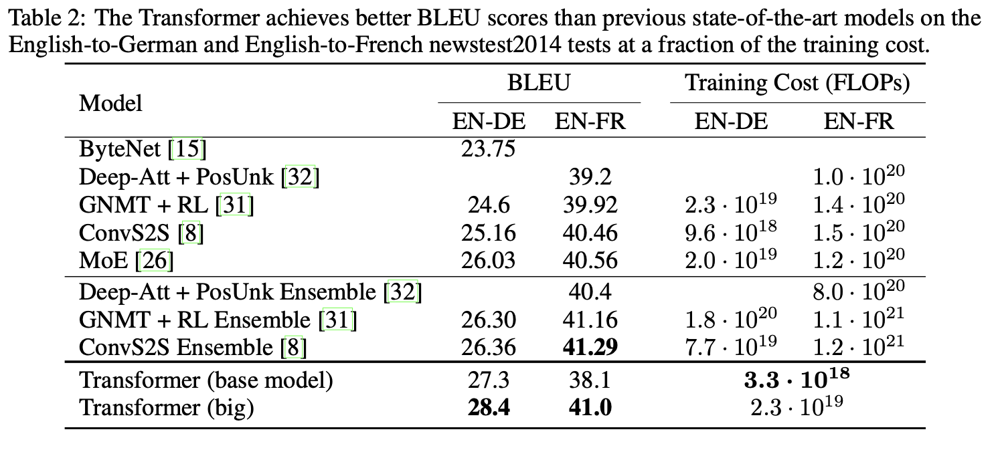

# Attention Is All You Need

#### Notes by: Katie Haller

## Make sure to keep asking the question: WHY???

*Taken from Attention Is All You Need*

### Embedding

In the embedding, words are represented by vectors. The idea is to create a mapping of the words so that similar words are "close" to each other. For example, we don't want a model to predict "I fed my (car)". We want the model to predict "I fed my (cat)". This way, cats and dogs and say fish are grouped together. So if the model doesn't predict "cat", it will predict "dog". The embedding layer in the encoder "compresses" say a vocabulary of 10k to 300 dimensional dense embeddings. The embedding layer in the decoder would "expand" back to 10k dimensions.

### Positional Encoding

The positional encoders help with relation to other words in the sentence. For example, "The animal didn't cross the street because it was too tired" as humans we know animal and it are the same. The positional encoding would be able to tell you that animal is in the 1st position and it is in the 9th, separated by 8 spaces. The equations used are:

$$PE_{(pos,2i)}=sin(pos/10000^{2i/d_{model}})$$
$$PE_{(pos,2i+1)}=cos(pos/10000^{2i/d_{model}})$$

$pos$ is the position and $i$ is the dimension. The details on how this actually works is tricky. However, $PE_{pos}$ and $PE_{pos+k}$ is linear. 

### Attention Functions

The paper only mentions two different types of attention, (scaled dot product and multi-head) however, there are actually many more types of attention. Below is a table of popular alignment score functions: 

*Taken from the Attention - Attention article*

Since the paper only mentions two attention scores, let's look at those. 

#### Scaled Dot Product

Something that is very important in the Attention paper is actually the attention function. The purpose is to focus on the important words. But the important question is how this is done. One way to help visualize is:

*Taken from A Simple Explanation of Transformers in NLP*

The dot product attention is much faster and more space efficient than additive attention.

A visualization for this attention function can be seen below:

#### Multi-head Attention

*Taken from Attention Is All You Need*

The main difference between Multi-head attention and scaled dot product is that in the multi-head attention, multiple processes happen simultaneously. The concept of this can be thought of similar to features. The multi-head attention is the main contribution of this paper.

#### Why Self Attention?

*From Attention Is All You Need*

>"Motivating our use of self-attention we consider three desiderata. One is the total computational complexity per layer. Another is the amount of computation that can be parallelized, as measured by the minimum number of sequential operations required. The third is the path length between long-range dependencies in the network." - Attention Is All You Need

The shorter the path, the easier it is to learn long range dependencies. When n < d, the faster self- attention is than both recurrent and convolutional. Self attention is faster and will be easier to learn long range dependencies. 

### Position-Wise Feed-Forward Networks

$$FFN(x)=max(0, xW_{1}+b_{1})W_{2}+b_{2}$$

### Training Cost

#### Optimizer

They used the Adam optimizer with $\beta_{1} = 0.9$, $\beta_{2} = 0.98$

$$lrate=d_{model}^{-0.5} • min(step\_num^{-0.5}, step\_num • warmup\_steps^{-1.5})$$

$d_{model} = 512$ and $warmup\_steps = 4000$, so when the step number reaches 4000, $lrate= 0.000699$.

#### Regularization

The higher the Bleu score, the better the model is performing. However, with FLOPS, the better number is the lower number, because it means that it is less expensive computationally.

Resources:

[Attention Is All You Need](https://arxiv.org/pdf/1706.03762.pdf)

[A Simple Explanation of Transformers in NLP](https://towardsdatascience.com/simple-explanation-of-transformers-in-nlp-da1adfc5d64f) - Medium article

[Attention - Attention](https://lilianweng.github.io/lil-log/2018/06/24/attention-attention.html) - Github article

[Linearity of Sinusoidal Positional Encodings](https://cs.brown.edu/courses/cs146/assets/files/linearity.pdf) - Brown University