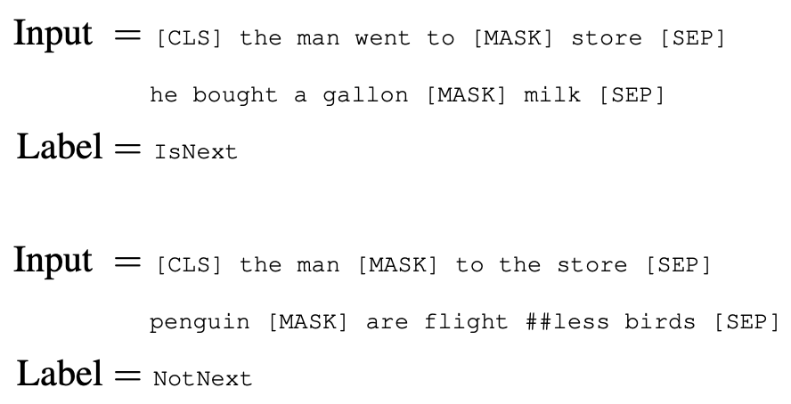
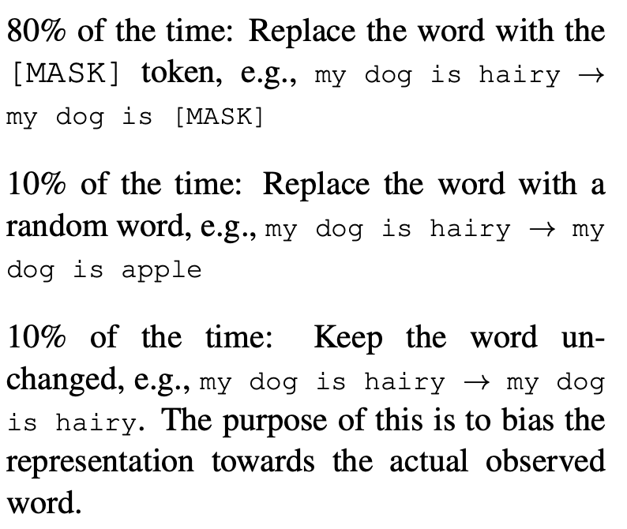
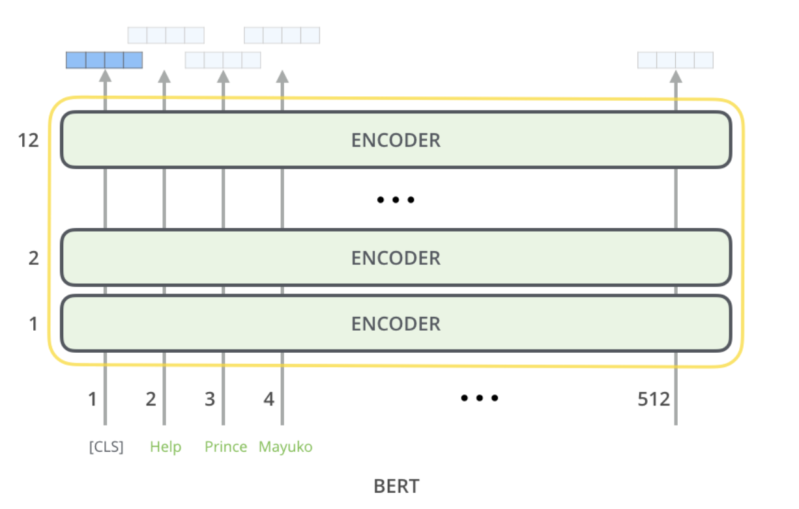

# BERT: Pre-training of Deep Bidirectional Transformers for Language Understanding

#### Notes by: Katie Haller

[1](#myfootnote1)

During the pre-training, the model is trained on unlabeled data. Later, the parameters are fine-tuned with labeled data from the downstream tasks.

Things to note about the figure above:
- C is a binary output for the next sentence prediction (NSP). It outputs a 1 if sentence B follows sentence A in context, and 0 otherwise.[2](#myfootnote2)
An example of this is: 

[1](#myfootnote1)
- Some words are masked 
A portion of those words are unchaged:

[1](#myfootnote1)

[1](#myfootnote1)

The segment embedding identifies if it's sentence A or B. The token embeddings can be viewed as word embeddings, except instead it is applied after WordPiece. The position embedding is added for the position in the sequence.

[4](#myfootnote4)

The BERT base is made up of 12 Transformer encoders.

In fine-tuning, the learning rate and batch size are less than pre-training.

Resources:

<a name="myfootnote1">1</a>: [BERT: Pre-training of Deep Bidirectional Transformers for Language Understanding](https://arxiv.org/pdf/1810.04805.pdf)

<a name ="myfootnote2">2</a>: [BERT Explained](https://www.youtube.com/watch?v=xI0HHN5XKDo)

<a name="myfootnote3">3</a>: [BERT Explained – A list of Frequently Asked Questions](https://yashuseth.blog/2019/06/12/bert-explained-faqs-understand-bert-working/#:~:text=The%20input%20representation%20used%20by,classification%20token%20%E2%80%93%20%5BCLS%5D.)

<a name="myfootnote4">4</a>: [The Illustrated BERT](http://jalammar.github.io/illustrated-bert/)