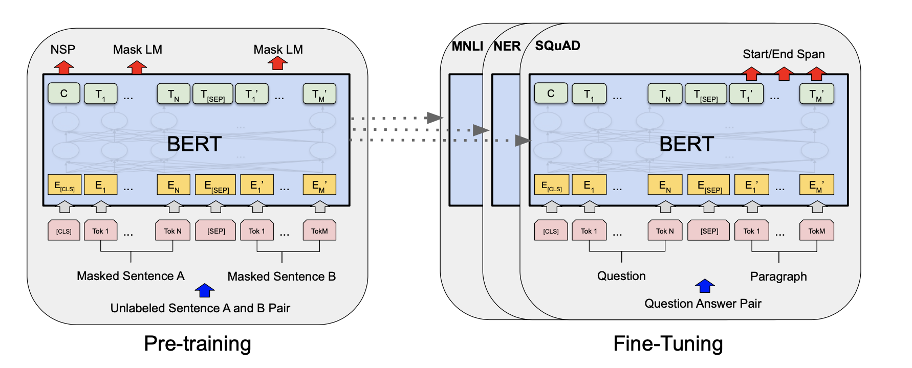
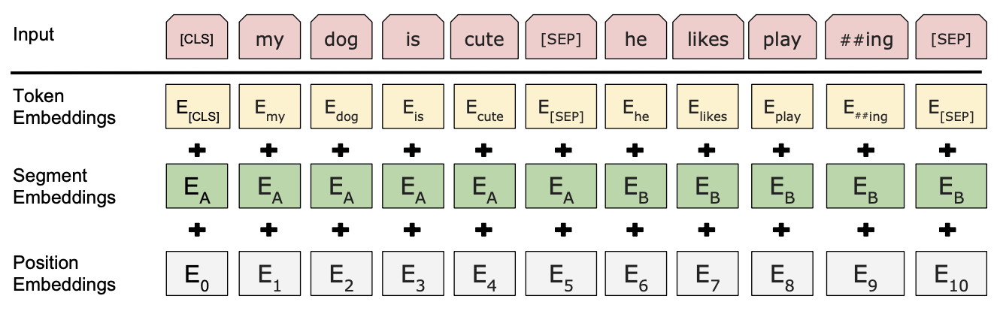

# BERT: Pre-training of Deep Bidirectional Transformers for Language Understanding

#### Notes by: Katie Haller

[1](#myfootnote1)

During the pre-training, the model is trained on unlabeled data. Later, the parameters are fine-tuned with labeled data from the downstream tasks.

Things to note about the figure above:
- C is a binary output for the next sentence prediction (NSP). It outputs a 1 if sentence B follows sentence A in context, and 0 otherwise.[2](#myfootnote2)
- Some words are masked (but why???)

Resources:

<a name="myfootnote1">1</a>: [BERT: Pre-training of Deep Bidirectional Transformers for Language Understanding](https://arxiv.org/pdf/1810.04805.pdf)

<a name ="myfootnote2">2</a>:[BERT Explained](https://www.youtube.com/watch?v=xI0HHN5XKDo)